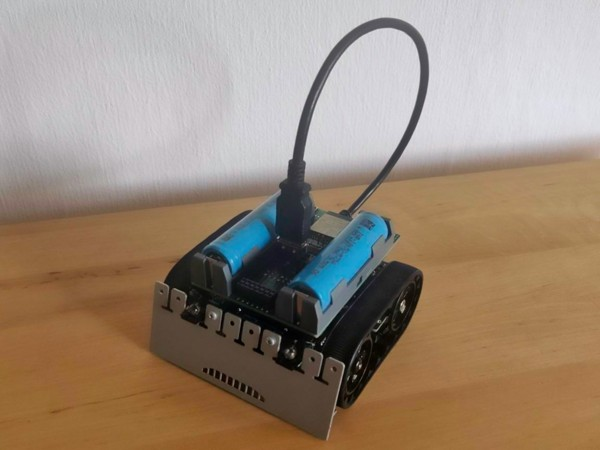

# Droid Control Ship - Firmware for ZumoComSystem <!-- omit in toc -->

[](http://choosealicense.com/licenses/mit/)
[](https://www.repostatus.org/#wip)
[](https://github.com/BlueAndi/DroidControlShip/releases)
[](https://github.com/BlueAndi/DroidControlShip/actions/workflows/main.yml)

The Droid Control Ship is the firmware running on the [ZumoComSystem](https://github.com/NewTec-GmbH/ZumoComSystem) hardware, which is a shield for the [Pololu 32U4 Zumo](https://www.pololu.com/product/2510) robot.

It provides different kind of exclusive applications, used for educational purposes:

* Convoy Leader Robot - Based on odometry information, it leads the followers to follow like a lemming trail.
* Convoy Follower Robot - It follows the leader by mainly reacting on the received information.
* Remote Control - Receives commands and motor speeds from an external source through MQTT.

## Table of content

* [The ZumoComSystem Shield](#the-zumocomsystem-shield)
* [The simulation](#the-simulation)
  * [Installation](#installation)
  * [How to start?](#how-to-start)
* [The target](#the-target)
  * [Installation](#installation-1)
  * [Build and flash procedure](#build-and-flash-procedure)
* [The Applications](#the-applications)
* [Documentation](#documentation)
* [Used Libraries](#used-libraries)
  * [Issues, Ideas And Bugs](#issues-ideas-and-bugs)
  * [License](#license)
  * [Contribution](#contribution)

# The ZumoComSystem Shield



It supports running in the [Webots simulation](https://www.cyberbotics.com/) too.

The Droid Control Ship communicates with the [Radon Ulzer](https://github.com/BlueAndi/RadonUlzer), which is the firmware running on the Pololu Zumo32U4 robot.

# The simulation

The simulation is based on the open source robot simulator *Webots*. The application and the services are equal to the target firmware. Only the HAL is different in the simulation.

* Website: <https://cyberbotics.com/#cyberbotics>
* Github: <https://github.com/cyberbotics/webots>


## Installation

1. Install the native compiler toolchain:
    * Linux
        * Install the gcc toolchain, depended on your distribution.
    * Windows
        * Install the [MSYS2](https://www.msys2.org) toolchain.
        * Open MSYS2 shell.
            * Update package database: ```pacman -Sy pacman```
            * Install GCC: ```pacman -Sy mingw-w64-ucrt-x86_64-gcc```
            * Install Mosquitto: ```pacman -Sy mingw-w64-ucrt-x86_64-mosquitto```
            * Install OpenSSL: ```pacman -S mingw-w64-ucrt-x86_64-openssl```

## How to start?

After you built the application, you will find in in ```.pio/build/<APPLICATION-NAME>/program.exe```. It provides several command line arguments to configure certain features. Use -h or --help to get a short user friendly overview about them.

The applications are using a configuration file in JSON format to retrieve certain settings. In the very first run, such a configuration file will be automatically be created. If there exists already one, it will be loaded without modifications (regardless of any other program arguments).

The DroidControlShip will always try to connect to the RadonUlzer, therefore its important to have the RadonUlzer executable started first! And because the RadonUlzer executable will always connect to the Webots simulation, it shall run as well having a corresponding world loaded.

Some applications require to have an MQTT server running, but it may depend on the kind of application you choose.

A complete deployment, including MQTT server, would be started in the following way:

MQTT Broker --> Webots World --> RadonUlzer --> DroidControlShip

In order to simplify this process, the [Launcher](https://github.com/gabryelreyes/Launcher) project is under active development.

# The target
The main target of the firmware is the [ZumoComSystem](https://github.com/NewTec-GmbH/ZumoComSystem) from NewTec GmbH, which is a shield for the [Pololu 32U4 Zumo](https://www.pololu.com/product/2510) robot.

Together with [Radon Ulzer](https://github.com/BlueAndi/RadonUlzer) it can be run in the [Webots simulation](https://www.cyberbotics.com/) too.


## Installation
1. Make sure that the hardware version of your [ZumoComSystem](https://github.com/NewTec-GmbH/ZumoComSystem) is supported. Currently, only v1.1 and v1.2 are supported.
2. Install the [drivers](https://www.silabs.com/developers/usb-to-uart-bridge-vcp-drivers?tab=downloads) for the CP2102 USB-UART converter if required. The "CP210x Universal Windows Driver" is recommended, as it enables the automatic bootloader mode.

## Build and flash procedure
1. Build the firmware using the ```Build``` task in the "PlatformIO Project Tasks"
    * For the target use only the applications with "Target" as postfix, e.g. LineFollowerTarget.
2. Upload the firmware to the ZumoComSystem using the ```Upload``` task in the "PlatformIO Project Tasks" tab, or the arrow on the bottom task bar.
3. After succesfully uploading the firmware, the configuration has to be uploaded to the filesystem. Make sure that the information in ```data/config/config.json``` matches your setup. Upload the configuration using the ```Upload Filesystem Image``` task in the "PlatformIO Project Tasks" tab.

Note that the robotName can be left empty in case you want the MAC address of the hardware to be used as the name. In case you prefer to give the robot a more descriptive name, can set the name. Beware, if you use multiple robots, you will have to give each a different name manually.

In a similar way, not providing a WiFi configuration will force the target into going into Access Point Mode. In a future update it will be possible to update the WiFi credentials using this mode and an on-board web server.

# The Applications

| Application | Standalone | Zumo32U4 Robot Required | RadonUlzer Application | MQTT Broker Required |
| - | - | - | - | - |
| ConvoyLeader | No | Yes | ConvoyLeader | Yes |
| ConvoyFollower | No | Yes | RemoteControl | Yes |
| RemoteControl | No | Yes | RemoteControl | Yes |
| SensorFusion | No | Yes | SensorFusion | Yes |
| Test | Yes | No | N/A | No |

# Documentation

* [SW Architecture](./doc/architecture/README.md)
* [SW Configuration](./doc/configuration/README.md)

# Used Libraries

| Library                                                                                        | Description                                                                                                                                    | License    |
| ---------------------------------------------------------------------------------------------- | ---------------------------------------------------------------------------------------------------------------------------------------------- | ---------- |
| [Arduino](https://github.com/platformio/platform-espressif32)                                  | ESP32 Arduino framework                                                                                                                        | Apache-2.0 |
| [Arduino client for MQTT](https://github.com/knolleary/pubsubclient)                           | This library provides a client for doing simple publish/subscribe messaging with a server that supports MQTT.                                  | MIT        |
| [ArduinoJson](https://arduinojson.org/)                                                        | JSON handling                                                                                                                                  | MIT        |
| [SerialMuxProt](https://github.com/gabryelreyes/SerialMuxProt)                                 | Multiplexing Communication Protocol                                                                                                            | MIT        |
| [USB_Host_Shield_2.0](https://github.com/NewTec-GmbH/USB_Host_Shield_2.0/tree/3_Endpoints_ACM) | Maxim USB-Host IC driver. Using fork of the [original](https://github.com/felis/USB_Host_Shield_2.0) library that solves issue with endpoints. | GPLv2      |

## Issues, Ideas And Bugs

If you have further ideas or you found some bugs, great! Create a [issue](https://github.com/BlueAndi/DroidControlShip/issues) or if you are able and willing to fix it by yourself, clone the repository and create a pull request.

## License

The whole source code is published under the [MIT license](http://choosealicense.com/licenses/mit/).
Consider the different licenses of the used third party libraries too!

## Contribution

Unless you explicitly state otherwise, any contribution intentionally submitted for inclusion in the work by you, shall be licensed as above, without any
additional terms or conditions.
