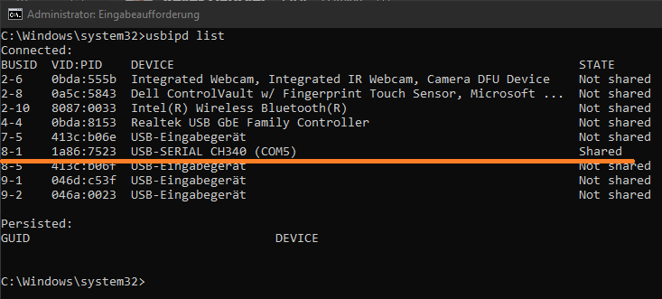

# Run micro-ROS on ESP32 Target
How setup and use micro-ROS DCS target `TurtleTarget`

## Build TurtleTarget
Perform standard pio build of the TurtleTarget application. It will pull the [micro_ros_platformio](https://github.com/micro-ROS/micro_ros_platformio) as library depenency and build scripts.

## bind USB port with WSL
Make the usb serial port visible to wsl in order to flash the binary using [usbipd](https://learn.microsoft.com/en-us/windows/wsl/connect-usb).

Run the following in an administrator shell:
```
usbipd bind --busid <busid>
```

Check available usb devices and sharing status.
```
usbipd list
```



Attach USB bus to wsl shell (no admin rights needed for attaching a shared port)
```
usbipd attach --wsl --busid <busid>
```
