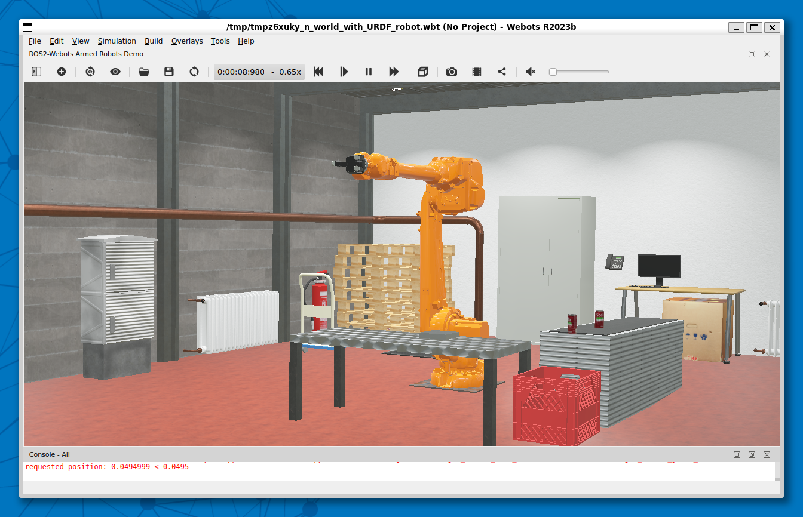

# Installation of Webots

## Webots Setup Procedure

Follow the official installation guide for Webots on Linux with APT on the
[Webots installation Page](https://cyberbotics.com/doc/guide/installation-procedure#installing-the-debian-package-with-the-advanced-packaging-tool-apt).

> **_NOTE:_**
Some of the steps result in larger package downloads.

Set environment variables for Webots home directory, the Webots controller library directory and add the Webots controller library to linker search path.

```bash
    echo "export WEBOTS_HOME=/usr/local/webots" >> $HOME/.bashrc
    echo "export WEBOTS_CONTROLLER_LIB_PATH=\$WEBOTS_HOME/lib" >> $HOME/.bashrc
    echo "export LD_LIBRARY_PATH=\$LD_LIBRARY_PATH:\$WEBOTS_CONTROLLER_LIB_PATH/controller" >> $HOME/.bashrc
    source $HOME/.bashrc
```

## Launching Webots

Try

```bash
    webots
```

If you get an error like "cannot open Display", try the following:

- close Ubuntu console
- In a Command window run

```bat
    wsl --update
```

- try running Webots again

## Webots ROS2 Package

The setup procedure is described on [this page](https://docs.ros.org/en/jazzy/Tutorials/Advanced/Simulators/Webots/Installation-Ubuntu.html)
from the Jazzy documentation. The listed package is not found by apt, so
install it using building from source.

Note: For the time being, we need to install a patched version from https://github.com/nhjschulz/webots_ros2.git.
The official one doesn't seem to support webots running inside WSL, but expects msys2/mingw.

transcript:

```bash
    mkdir -p ros2_webots_ws/src
    cd ros2_webots_ws
    git clone --recurse-submodules https://github.com/nhjschulz/webots_ros2.git src/webots_ros2

    sudo apt install python3-pip python3-rosdep python3-colcon-common-extensions
    sudo rosdep init && rosdep update
    rosdep install --from-paths src --ignore-src --rosdistro jazzy

    colcon build

```

## Running Webots ROS2 Universal Robot

See Task 2 from this [Jazzy documentation page](https://docs.ros.org/en/jazzy/Tutorials/Advanced/Simulators/Webots/Installation-Ubuntu.html#launch-the-webots-ros2-universal-robot-example)

```bash
    export WEBOTS_HOME=/usr/local/webots
    export WEBOTS_CONTROLLER_LIB_PATH=$WEBOTS_HOME/lib
    export LD_LIBRARY_PATH=$LD_LIBRARY_PATH:$WEBOTS_CONTROLLER_LIB_PATH/controller

    cd ros2_webots_ws
    source install/local_setup.bash

    ros2 launch webots_ros2_universal_robot multirobot_launch.py
```

You should get the following simulation on the screen:



## Setting up a Webots Simulation with ROS2 controller

Read [this article](https://docs.ros.org/en/jazzy/Tutorials/Advanced/Simulators/Webots/Setting-Up-Simulation-Webots-Basic.html)
to learn how to create a ROS2 controller package for the Webots simulation.

## Webots Supervisor

Right now it is not clear if we need the ROS2 supervisor in Webots.
A good explanation about the purpose of the supervisor is in the [supervisor manual of Webots](https://docs.ros.org/en/jazzy/Tutorials/Advanced/Simulators/Webots/Simulation-Supervisor.html#the-ros2supervisor).

The clock topic might be important.
