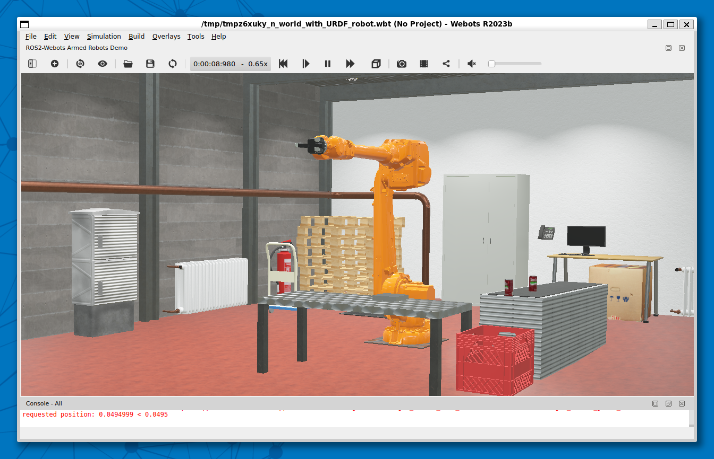

# Installation of Webots <!-- omit in toc -->

- [Windows](#windows)
  - [Webots ROS2 Package (Webots on Windows)](#webots-ros2-package-webots-on-windows)
  - [Running Webots ROS2 Universal Robot (on Windows)](#running-webots-ros2-universal-robot-on-windows)
- [Linux](#linux)
  - [Webots Setup Procedure](#webots-setup-procedure)
  - [Launching Webots](#launching-webots)
  - [Webots ROS2 Package (Webots in WSL)](#webots-ros2-package-webots-in-wsl)
  - [Running Webots ROS2 Universal Robot (on Linux)](#running-webots-ros2-universal-robot-on-linux)
- [Setting up a Webots Simulation with ROS2 controller](#setting-up-a-webots-simulation-with-ros2-controller)
- [Webots Supervisor](#webots-supervisor)

## Windows

Follow the official installation guide for Webots on Windows in the [Webots User Guide Installation Procedure](https://cyberbotics.com/doc/guide/installation-procedure#installation-on-windows).

ROS2 requires Linux, therefore in this setup RadonUlzer and DroidControlShip are running inside the WSL. They will connect via TCP to Webots running on the host system.

### Webots ROS2 Package (Webots on Windows)

The setup procedure is described on [this page](https://docs.ros.org/en/jazzy/Tutorials/Advanced/Simulators/Webots/Installation-Windows.html) from the Jazzy documentation. If the listed package is not found by apt, you will need to install it by building from source.

### Running Webots ROS2 Universal Robot (on Windows)

See Task 2 from this [Jazzy documentaion page](https://docs.ros.org/en/jazzy/Tutorials/Advanced/Simulators/Webots/Installation-Ubuntu.html#launch-the-webots-ros2-universal-robot-example)

Replace ```<DRIVE>/<WEBOTS-INSTALLATION_DIRECTORY>``` in the following terminal commands:

```bash
    export WEBOTS_HOME=/mnt/<DRIVE>/<WEBOTS-INSTALLATION_DIRECTORY>
    export WEBOTS_CONTROLLER_LIB_PATH=$WEBOTS_HOME/lib
    export LD_LIBRARY_PATH=$LD_LIBRARY_PATH:$WEBOTS_CONTROLLER_LIB_PATH/controller

    cd ros2_webots_ws
    source install/local_setup.bash

    ros2 launch webots_ros2_universal_robot multirobot_launch.py
```

You should get the following simulation on the screen:



## Linux

### Webots Setup Procedure

Follow the official installation guide for Webots on Linux with APT in the [Webots User Guide Installation Procedure](https://cyberbotics.com/doc/guide/installation-procedure#installing-the-debian-package-with-the-advanced-packaging-tool-apt).

> **_NOTE:_**
Some of the steps result in larger package downloads.

Set environment variables for Webots home directory, the Webots controller library directory and add the Webots controller library to linker search path.

```bash
    echo "export WEBOTS_HOME=/usr/local/webots" >> $HOME/.bashrc
    echo "export WEBOTS_CONTROLLER_LIB_PATH=\$WEBOTS_HOME/lib" >> $HOME/.bashrc
    echo "export LD_LIBRARY_PATH=\$LD_LIBRARY_PATH:\$WEBOTS_CONTROLLER_LIB_PATH/controller" >> $HOME/.bashrc
    source $HOME/.bashrc
```

### Launching Webots

Try

```bash
    webots
```

If you get an error like "cannot open Display", try the following:

- close Ubuntu console
- In a Command window run

```bat
    wsl --update
```

- try running Webots again

### Webots ROS2 Package (Webots in WSL)

The setup procedure is described on [this page](https://docs.ros.org/en/jazzy/Tutorials/Advanced/Simulators/Webots/Installation-Ubuntu.html) from the Jazzy documentation. If the listed package is not found by apt, you will need to install it by building from source.

Because of [Webots Issue 6570 in webots-ros2-driver](https://github.com/cyberbotics/webots/issues/6570), running Webots inside the WSL requires a small local change.  If it detects that the system is a WSL system, it will try to run ```webots.exe``` instead of ```webots```.

```bash
sudo nano /opt/ros/jazzy/lib/python3.12/site-packages/webots_ros2_driver/utils.py
```

Required change:

```python
def is_wsl():
    # return 'microsoft-standard' in uname().release
    return False
```

### Running Webots ROS2 Universal Robot (on Linux)

See Task 2 from this [Jazzy documentation page](https://docs.ros.org/en/jazzy/Tutorials/Advanced/Simulators/Webots/Installation-Ubuntu.html#launch-the-webots-ros2-universal-robot-example)

```bash
    export WEBOTS_HOME=/usr/local/webots
    export WEBOTS_CONTROLLER_LIB_PATH=$WEBOTS_HOME/lib
    export LD_LIBRARY_PATH=$LD_LIBRARY_PATH:$WEBOTS_CONTROLLER_LIB_PATH/controller

    cd ros2_webots_ws
    source install/local_setup.bash

    ros2 launch webots_ros2_universal_robot multirobot_launch.py
```

You should get the following simulation on the screen:


## Setting up a Webots Simulation with ROS2 controller

Read [this article](https://docs.ros.org/en/jazzy/Tutorials/Advanced/Simulators/Webots/Setting-Up-Simulation-Webots-Basic.html)
to learn how to create a ROS2 controller package for the Webots simulation.

## Webots Supervisor

Right now it is not clear if we need the ROS2 supervisor in Webots.
A good explanation about the purpose of the supervisor is in the [supervisor manual of Webots](https://docs.ros.org/en/jazzy/Tutorials/Advanced/Simulators/Webots/Simulation-Supervisor.html#the-ros2supervisor).

The clock topic might be important.
