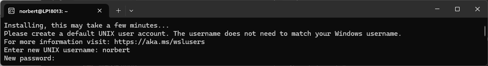
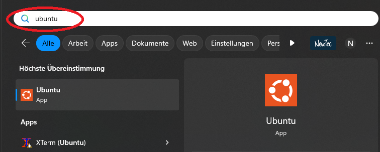
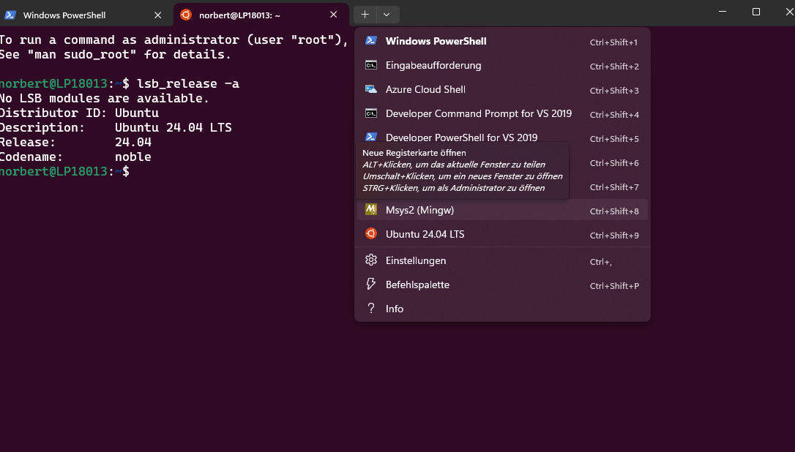

# Installation of WSL for ROS2 Jazzy

Each ROS2 distribution targets a specific Linux environment. 
For Jazzy it is *Ubuntu 24.04*. To run it on Windows 10/11, 
the WSL2 feature will be used.

## Install WSL 

Installing WSL (Linux on Windows) is officially supported by Microsoft.
For details refer to the following
[Microsoft documentation](https://learn.microsoft.com/en-us/windows/wsl/install).

But all you need is this from a windows power shell:

```bat
    wsl --update
    wsl --install -d "Ubuntu-24.04"
```

> **_NOTE:_**
A Windows message dialog may popup in the background, to ask for elevated rights. 
Check for such a window if the installation does not progress.

## First time use

A console window should appear with installation messages. It will ask you
for a user name and password. Use values you remember, as you need this password
later whenever you install software.



If no window opens, or you get an error message, try rebooting. Windows may
require updates to install for WSL. Then start an Ubuntu console from start menu:



If a root shell is started and there was no user created, add a user manually in the linux shell:

```bash
    adduser <username>
    usermod -aG sudo <username>
```

Configure Ubuntu to login by default with your user in the windows power shell:

```bat
    ubuntu2404 config --default-user <username>
```

## Checking Installation

Check that you have the right distribution installed (Ubuntu 24.04 LTS):

```bash
    $  lsb_release -a
    No LSB modules are available.
    Distributor ID: Ubuntu
    Description:    Ubuntu 24.04 LTS
    Release:        24.04
    Codename:       noble
```

## New Terminal Window

Is is recommended to install the new Microsoft Terminal Window 
if not done already. It is available from

[Github Microsoft Terminal](https://github.com/microsoft/terminal).

It offers tabs, history and embedds all kinds of shells (cmd, powershell, Ubuntu, git ...)



## Exposing WSL UDP Ports to the Network

To make UDP ports listening in WSL accessible from your local network, follow these steps:
Find your WSL IP address by running this command in WSL:

```bash
ip addr show eth0
```

> **_NOTE:_**
UDP port forwarding to wsl is not supported without mirrored networking (WSL 2.0.0 on win11)

Open a terminal in an administrator shell on Windows.
Run the following command to forward the UDP port, replacing [PORT] with your desired port number (usually 8888) and [WSL_IP] with the IP address:

```bat
netsh interface portproxy add v4tov4 listenport=[PORT] listenaddress=0.0.0.0 connectport=[PORT] connectaddress=[WSL_IP]
```

To view all forwarded ports:

```bat
netsh interface portproxy show all
```

To remove a port forward:

```bat
netsh interface portproxy delete v4tov4 listenport=[PORT] listenaddress=0.0.0.0
```
